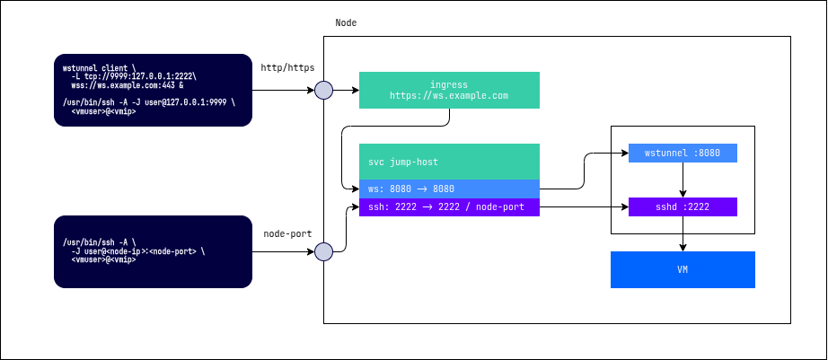

# ssh-jumphost service

Default user: `user`
SSH port: `2222`
WebSocket port: `8080`



## access via wss trough ssh-jumphost

```bash
wstunnel client -L tcp://9999:127.0.0.1:2222  wss://ws.example.com:443 &
/usr/bin/ssh \
              -A \
              -J user@127.0.0.1:9999 \
              -o StrictHostKeyChecking=no \
              -o UserKnownHostsFile=/dev/null \
              cloud@10.66.10.1
```

or

create `config` file

```json
Host jumphost
	ForwardAgent yes
	Hostname 127.0.0.1
  StrictHostKeyChecking no
  UserKnownHostsFile /dev/null
	Port 2222
	User user
	ProxyCommand wstunnel client --log-lvl=off -L stdio://%h:%p wss://ws.example.com:443
Host vm
	ForwardAgent yes
	Hostname 10.66.10.1
	Port 22
	User cloud
	ProxyJump jumphost
```

```bash
ssh -F ./config vm
```

## strict access to VM

add to deployment

```yaml
- name: WSTUNNEL_DST
  value: 10.66.10.1:22
```

```bash
ssh -o ProxyCommand="wstunnel client --log-lvl=off -L stdio://%h:%p wss://ws.example.com:443" cloud@10.66.10.1
```
